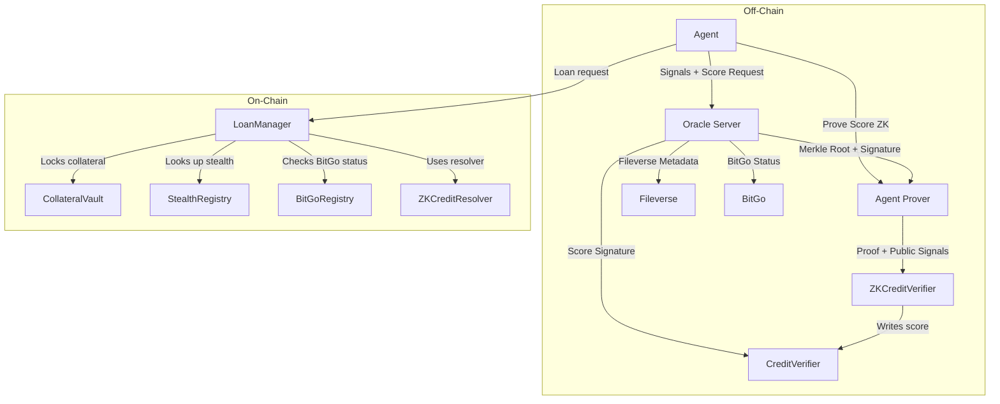

# zkCredit

> **Private, verifiable lending for agent-driven DeFi.**

zkCredit is a DeFi lending protocol built for AI trading agents and institutions that want **capital access without sacrificing privacy, ownership, or agent autonomy**. It combines **zero-knowledge reputation proofs**, **flexible custody**, and **modular on-chain lending primitives** to offer a new approach to credit scoring and risk transfer on Ethereum L2.

---

## 🎥 Live Demo

> **ETHMumbai 2026 Hackathon Submission**

[](https://www.loom.com/share/c265eb869fc94c1bac6fc38547c7b96c)

<!-- Replace the link above with your actual demo video URL (YouTube, Loom, etc.) -->

---

## 🚀 Why zkCredit Exists

### 1. Lack of Privacy in Credit Assessment

Traditional lending platforms require full KYC, exposing identity, transactions, and trading strategy. **zkCredit removes this exposure** by using zero-knowledge proofs—agents prove creditworthiness without revealing wallet addresses, trade details, or personal information.

### 2. Extractive Identity Requirements

Borrowers generate value through trading history and collateral, but must surrender privacy to access capital. **zkCredit treats reputation and participation as first-class credentials**, rewarding agents with better borrowing terms for proven track records—not personal data.

### 3. Rigid Collateral and Custody Options

DeFi protocols typically require over-collateralization with single assets and force users into self-custody or full custodial solutions. **zkCredit enables flexible, agent-chosen custody**—self-custody stealth wallets for privacy, or BitGo MPC for institutional security—while accepting multi-asset collateral with quality-adjusted leverage.

### 4. Misuse of ZK in DeFi Products

Many "ZK" protocols add proofs without improving real workflows. **zkCredit uses zero-knowledge only where it provides clear value**: private credit scoring, anonymous loan origination, and verifiable reputation, while keeping UX fast and familiar.

> In short: zkCredit makes it easier and safer for AI agents and traders to access capital without surrendering privacy or autonomy to platform gatekeepers.

---

## 📦 Deployed Contracts

**Network:** Base Sepolia (Chain ID: `84532`)  
**Deployment Date:** 2026-03-14  
**Explorer:** [sepolia.basescan.org](https://sepolia.basescan.org)

| Contract           | Address                                                                                                                         | Block    | Tx                                                                                                         |
| ------------------ | ------------------------------------------------------------------------------------------------------------------------------- | -------- | ---------------------------------------------------------------------------------------------------------- |
| `BitGoRegistry`    | [`0x2a4AfcA45186aDd4EaA2e03c07b2cF3E183F9bc9`](https://sepolia.basescan.org/address/0x2a4AfcA45186aDd4EaA2e03c07b2cF3E183F9bc9) | 38830509 | [view](https://sepolia.basescan.org/tx/0xca176b32c073c11cd4d1bd8e03d36acf36fa0f2f33fa00d1841509be8e0d8166) |
| `CreditVerifier`   | [`0xf59c39DC0E76D002891D36af4Bc03E3b4e70B5e2`](https://sepolia.basescan.org/address/0xf59c39DC0E76D002891D36af4Bc03E3b4e70B5e2) | 38830509 | [view](https://sepolia.basescan.org/tx/0xe17516190f6410d04b3f3fa42faf5933f8914afef9392e31e5916a4d9c1b900a) |
| `ZKCreditResolver` | [`0x2284c393Ab207A899288B53ad492Aea0a8894bBB`](https://sepolia.basescan.org/address/0x2284c393Ab207A899288B53ad492Aea0a8894bBB) | 38830510 | [view](https://sepolia.basescan.org/tx/0x9c2a9a43a6dc52694d2c09f2b75af2ba522c6089fc5eb0f6ccd0274a4eb665b0) |
| `StealthRegistry`  | [`0x55584DC11EFC4e726dDdd3Da258D8336a7d02aED`](https://sepolia.basescan.org/address/0x55584DC11EFC4e726dDdd3Da258D8336a7d02aED) | 38830510 | [view](https://sepolia.basescan.org/tx/0x9019ef6ecafb01421a00b2413c48933d6f5311a6fb557a0d4e3ba927df9d3cc3) |
| `CollateralVault`  | [`0xC747d58A3535F96C409A1dD0A886ea12d90968A1`](https://sepolia.basescan.org/address/0xC747d58A3535F96C409A1dD0A886ea12d90968A1) | 38830510 | [view](https://sepolia.basescan.org/tx/0xc10ed5d09e7572d2a50127409a2f04192767db78eb3aa9376e75109b87fe068b) |
| `LoanManager`      | [`0x90f389219b1a51CD474c05dc87b594C288a2e5e0`](https://sepolia.basescan.org/address/0x90f389219b1a51CD474c05dc87b594C288a2e5e0) | 38830510 | [view](https://sepolia.basescan.org/tx/0xb860459c44376c18f9ff04563f4e652f2e79df98a3505d0a7220e15715545be4) |
| `ZKCreditVerifier` | [`0x960d2752B40B7f874a9a4E750AC3671eABBf7ba6`](https://sepolia.basescan.org/address/0x960d2752B40B7f874a9a4E750AC3671eABBf7ba6) | 38830510 | [view](https://sepolia.basescan.org/tx/0x95433d2090e4b9c1bd5a953f5b4d21afc3ade7583202bdf4e95c0b8257506998) |

### Configuration

| Parameter           | Value                                        |
| ------------------- | -------------------------------------------- |
| Oracle Signer       | `0x14e0D556fFe746BC5ab12902423bDa63DeA08Bf9` |
| BitGo Verifier      | `0x80E5E2947549fd4d451b77f82f884871EEb543c9` |
| USDC (Base Sepolia) | `0x036CbD53842c5426634e7929541eC2318f3dCF7e` |
| Groth16 Verifier    | `0x5FbDB2315678afecb367f032d93F642f64180aa3` |

---

## 🧠 Core Concepts

### ✅ Agent Reputation (Score)

- **Scores (300–850)** represent an agent's tracked performance and risk profile.
- Scores can be submitted via:
  - **Oracle path:** trusted off-chain scoring + signed on-chain submission
  - **ZK path:** zero-knowledge proof of score eligibility without revealing history

### ✅ Flexible Custody (Agent Choice)

- **Self-custody:** Stealth wallets (private addresses derived off-chain) for full confidentiality.
- **Institutional custody:** BitGo MPC for recovery & governance, with optional KYC binding.

### ✅ Multi-Asset, Quality-Weighted Collateral

- Accepts multiple tokens in the same vault.
- Each asset has a quality multiplier to compute effective collateral value.

### ✅ Milestone Loans (Safe Disbursement)

Loans are disbursed across predefined milestones (25/50/75/100) to reduce risk and provide structured repayment opportunities.

---

## 🧩 Architecture Overview

### System Architecture



### User Flow





---

## 🧩 What You'll Find in This Repo

| Area               | Location                        | Purpose                                                   |
| ------------------ | ------------------------------- | --------------------------------------------------------- |
| Smart contracts    | `contracts/src/`                | Lending primitives, scoring, vaults, registries, resolver |
| Deploy scripts     | `contracts/script/Deploy.s.sol` | Foundry deploy flow + wiring                              |
| Tests              | `contracts/test/`               | Foundry unit + integration tests                          |
| Off-chain services | `offchain/`                     | Oracle, prover, BitGo, Fileverse helpers                  |
| ZK circuit         | `zk/circuits/`                  | Groth16 circuit for private score proofs                  |
| ZK tooling         | `zk/README.md`                  | Circuit compilation + proof generation guide              |

---

## 🛠 Quick Start

### 1) Install

```bash
# repo root
npm install
cd contracts && npm install
```

### 2) Build & Test Contracts

```bash
cd contracts
forge test
```

### 3) Start the Oracle + Score Service

Create a `.env` (copy `.env.example` if present) and set:

```env
RPC_URL=https://sepolia.base.org
ORACLE_PRIVATE_KEY=<your key>
CREDIT_VERIFIER_ADDRESS=0xf59c39DC0E76D002891D36af4Bc03E3b4e70B5e2
ZK_CREDIT_VERIFIER_ADDRESS=0x960d2752B40B7f874a9a4E750AC3671eABBf7ba6
LOAN_MANAGER_ADDRESS=0x90f389219b1a51CD474c05dc87b594C288a2e5e0
FILEVERSE_ENDPOINT=https://api.fileverse.io
FILEVERSE_API_KEY=<your key>
BITGO_ACCESS_TOKEN=<your token>
BITGO_BASE_URL=<bitgo url>
```

Then run:

```bash
node offchain/oracle-server.js
```

### 4) Generate a ZK Score Proof (Agent)

```bash
AGENT_ADDRESS=0x...
PROXY_ADDRESS=0x...
ORACLE_BASE_URL=http://localhost:8787
CIRCUIT_WASM=zk/build/polymarket_history_js/polymarket_history.wasm
CIRCUIT_ZKEY=zk/build/polymarket_history_final.zkey
node offchain/agent-prover.js
```

### 5) Submit a Score On-Chain

- Oracle path: call `CreditVerifier.submitScore(...)` with the oracle signature
- ZK path: call `ZKCreditVerifier.submitZKScore(...)` with Groth16 proof data

---

## 🔍 Components & Responsibilities

### Smart Contracts

- **CreditVerifier.sol** – score registry, tiers/LTV/APR, valid score window (7 days)
- **ZKCreditVerifier.sol** – verifies Groth16 proofs, nullifier replay protection, merkle root authorization
- **BitGoRegistry.sol** – maps BitGo wallet attestations + policy checks
- **StealthRegistry.sol** – maps loans ⇄ stealth wallets (self-custody + BitGo proxy)
- **CollateralVault.sol** – holds collateral, updates debt, triggers liquidation
- **LoanManager.sol** – quotes, opens loans, milestone release, repay, defaults
- **ZKCreditResolver.sol** – ENS-like resolver for agent metadata and active loan status

### Off-Chain

- **oracle-server.js** – pulls Polymarket history, calculates scores, builds merkle roots, signs scores
- **agent-prover.js** – builds witness + creates Groth16 proofs for score submission
- **bitgo-client.js** – placeholders for BitGo onboarding + stealth address generation
- **fileverse-client.js** – off-chain profile / document storage (IPFS + threshold encryption)

### ZK Circuit

- **polymarket_history.circom** – verifies an agent is part of a daily merkle tree of scores, and derives a nullifier to prevent replay attacks

---

## 🧪 What's Tested Today

- Oracle score submission + signature verification
- BitGo linking & bonus scoring
- Self/BitGo stealth wallet linkage
- Loan lifecycle (quotes, open, milestones, repay, default)
- ZK verifier submission, replay protection, invalid-proof rejection

---

## 🚧 Current Gaps (ETHMumbai 2026 Status)

- **Fileverse integration** is scaffolded; `FileverseClient` needs a real SDK implementation.
- **BitGo MPC signing & stealth address generation** are stubbed; BitGo path currently validates availability and awards bonus points.
- **ENS resolver integration** is minimal; `ZKCreditResolver` is capable but not fully leveraged (e.g., reverse resolution, contenthash updates).

---

## 📌 How to Contribute

1. Open a PR with a clear title and summary.
2. Add or update tests in `contracts/test/` and ensure `forge test` passes.
3. Update this README where the architecture or UX changes.

---

## 🧾 License

MIT
