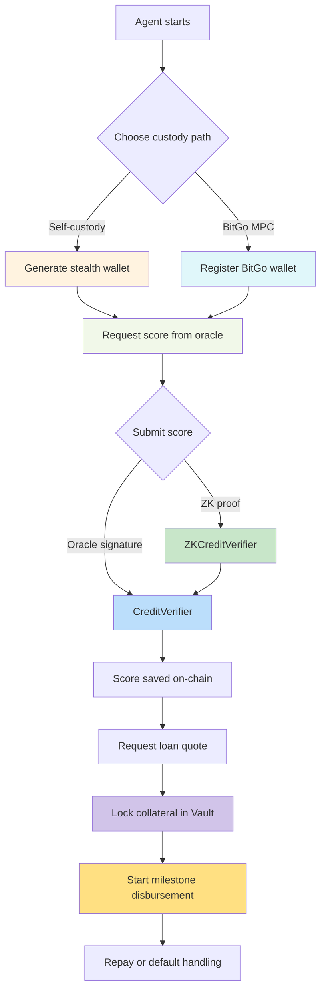

# zkCredit

> **Private, verifiable lending for agent-driven DeFi.**

zkCredit is a DeFi lending protocol built for AI trading agents and institutions that want **capital access without sacrificing privacy, ownership, or agent autonomy**. It combines **zero-knowledge reputation proofs**, **flexible custody**, and **modular on-chain lending primitives** to offer a new approach to credit scoring and risk transfer on Ethereum L2.

---

## 🚀 Why zkCredit Exists

### 1. Lack of Privacy in Credit Assessment
Traditional lending platforms require full KYC, exposing identity, transactions, and trading strategy. **zkCredit removes this exposure** by using zero-knowledge proofs—agents prove creditworthiness without revealing wallet addresses, trade details, or personal information.

### 2. Extractive Identity Requirements
Borrowers generate value through trading history and collateral, but must surrender privacy to access capital. **zkCredit treats reputation and participation as first-class credentials**, rewarding agents with better borrowing terms for proven track records—not personal data.

### 3. Rigid Collateral and Custody Options
DeFi protocols typically require over-collateralization with single assets and force users into self-custody or full custodial solutions. **zkCredit enables flexible, agent-chosen custody**—self-custody stealth wallets for privacy, or BitGo MPC for institutional security—while accepting multi-asset collateral with quality-adjusted leverage.

### 4. Misuse of ZK in DeFi Products
Many “ZK” protocols add proofs without improving real workflows. **zkCredit uses zero-knowledge only where it provides clear value**: private credit scoring, anonymous loan origination, and verifiable reputation, while keeping UX fast and familiar.

> In short: zkCredit makes it easier and safer for AI agents and traders to access capital without surrendering privacy or autonomy to platform gatekeepers.

---

## 🧠 Core Concepts

### ✅ Agent Reputation (Score)
- **Scores (300–850)** represent an agent’s tracked performance and risk profile.
- Scores can be submitted via:
  - **Oracle path:** trusted off-chain scoring + signed on-chain submission
  - **ZK path:** zero-knowledge proof of score eligibility without revealing history

### ✅ Flexible Custody (Agent Choice)
- **Self-custody:** Stealth wallets (private addresses derived off-chain) for full confidentiality.
- **Institutional custody:** BitGo MPC for recovery & governance, with optional KYC binding.

### ✅ Multi-Asset, Quality-Weighted Collateral
- Accepts multiple tokens in the same vault.
- Each asset has a quality multiplier to compute effective collateral value.

### ✅ Milestone Loans (Safe Disbursement)
Loans are disbursed across predefined milestones (25/50/75/100) to reduce risk and provide structured repayment opportunities.

---

## 🧩 Architecture Overview (Mermaid)

### High-Level System Diagram

```mermaid
flowchart TD
  subgraph Off-Chain
    A[Agent] -->|Signals + Score Request| B[Oracle Server]
    A -->|Prove Score (ZK)| C[Agent Prover]
    B -->|Merkle Root + Signature| C
    B -->|Score Signature| D[CreditVerifier]
    C -->|Proof + Public Signals| E[ZKCreditVerifier]
    B -->|Fileverse Metadata| F[Fileverse]
    B -->|BitGo Status| G[BitGo]
  end

  subgraph On-Chain
    D[CreditVerifier]
    E[ZKCreditVerifier]
    H[LoanManager]
    I[CollateralVault]
    J[StealthRegistry]
    K[BitGoRegistry]
    L[ZKCreditResolver]
  end

  E -->|Writes score| D
  A -->|Loan request| H
  H -->|Locks collateral| I
  H -->|Looks up stealth| J
  H -->|Uses resolver| L
  H -->|Checks BitGo status| K

  style B fill:#f9f,stroke:#333,stroke-width:1px
  style D fill:#b3e5fc,stroke:#333,stroke-width:1px
  style E fill:#c8e6c9,stroke:#333,stroke-width:1px
  style H fill:#ffe0b2,stroke:#333,stroke-width:1px
  style I fill:#d1c4e9,stroke:#333,stroke-width:1px
  style J fill:#ffd54f,stroke:#333,stroke-width:1px
  style K fill:#b2dfdb,stroke:#333,stroke-width:1px
  style L fill:#f48fb1,stroke:#333,stroke-width:1px
```

### User Flow (Agent Loan Lifecycle)



---

## 🧩 What You’ll Find in This Repo

| Area | Location | Purpose |
|------|----------|---------|
| Smart contracts | `contracts/src/` | Lending primitives, scoring, vaults, registries, resolver
| Deploy scripts | `contracts/script/Deploy.s.sol` | Foundry deploy flow + wiring
| Tests | `contracts/test/` | Foundry unit + integration tests
| Off-chain services | `offchain/` | Oracle, prover, BitGo, Fileverse helpers
| ZK circuit | `zk/circuits/` | Groth16 circuit for private score proofs
| ZK tooling | `zk/README.md` | Circuit compilation + proof generation guide

---

## 🛠 Quick Start (ETHMumbai Friendly)

### 1) Install

```bash
# repo root
npm install
cd contracts && npm install
```

### 2) Build & Test Contracts

```bash
cd contracts
forge test
```

### 3) Start the Oracle + Score Service

Create a `.env` (copy `.env.example` if present) and set:
- `RPC_URL` (Local node or testnet)
- `ORACLE_PRIVATE_KEY`
- `CREDIT_VERIFIER_ADDRESS`
- `ZK_CREDIT_VERIFIER_ADDRESS`
- `LOAN_MANAGER_ADDRESS`
- `FILEVERSE_ENDPOINT` / `FILEVERSE_API_KEY`
- `BITGO_ACCESS_TOKEN` / `BITGO_BASE_URL`

Then run:

```bash
node offchain/oracle-server.js
```

### 4) Generate a ZK Score Proof (Agent)

```bash
AGENT_ADDRESS=0x...
PROXY_ADDRESS=0x...
ORACLE_BASE_URL=http://localhost:8787
CIRCUIT_WASM=zk/build/polymarket_history_js/polymarket_history.wasm
CIRCUIT_ZKEY=zk/build/polymarket_history_final.zkey
node offchain/agent-prover.js
```

### 5) Submit a Score On-Chain

- Oracle path: call `CreditVerifier.submitScore(...)` with the oracle signature
- ZK path: call `ZKCreditVerifier.submitZKScore(...)` with Groth16 proof data

---

## 🔍 Components & Responsibilities

### Smart Contracts
- **CreditVerifier.sol** – score registry, tiers/LTV/APR, valid score window (7 days)
- **ZKCreditVerifier.sol** – verifies Groth16 proofs, nullifier replay protection, merkle root authorization
- **BitGoRegistry.sol** – maps BitGo wallet attestations + policy checks
- **StealthRegistry.sol** – maps loans ⇄ stealth wallets (self-custody + BitGo proxy)
- **CollateralVault.sol** – holds collateral, updates debt, triggers liquidation
- **LoanManager.sol** – quotes, opens loans, milestone release, repay, defaults
- **ZKCreditResolver.sol** – ENS-like resolver for agent metadata and active loan status

### Off-Chain
- **oracle-server.js** – pulls Polymarket history, calculates scores, builds merkle roots, signs scores
- **agent-prover.js** – builds witness + creates Groth16 proofs for score submission
- **bitgo-client.js** – placeholders for BitGo onboarding + stealth address generation
- **fileverse-client.js** – off-chain profile / document storage (IPFS + threshold encryption)

### ZK Circuit
- **polymarket_history.circom** – verifies an agent is part of a daily merkle tree of scores, and derives a nullifier to prevent replay attacks

---

## 🧪 What’s Tested Today

- Oracle score submission + signature verification
- BitGo linking & bonus scoring
- Self/BitGo stealth wallet linkage
- Loan lifecycle (quotes, open, milestones, repay, default)
- ZK verifier submission, replay protection, invalid-proof rejection

---

## 🚧 Current Gaps (2026 EthMumbai Status)

- **Fileverse integration** is scaffolded; `FileverseClient` needs a real SDK implementation.
- **BitGo MPC signing & stealth address generation** are stubbed; BitGo path currently validates availability and awards bonus points.
- **ENS resolver integration** is minimal; `ZKCreditResolver` is capable but not fully leveraged (e.g., reverse resolution, contenthash updates).

---

## 📌 How to Contribute

1. Open a PR with a clear title and summary.
2. Add or update tests in `contracts/test/` and ensure `forge test` passes.
3. Update this README where the architecture or UX changes.

---

## 🧾 License
MIT

